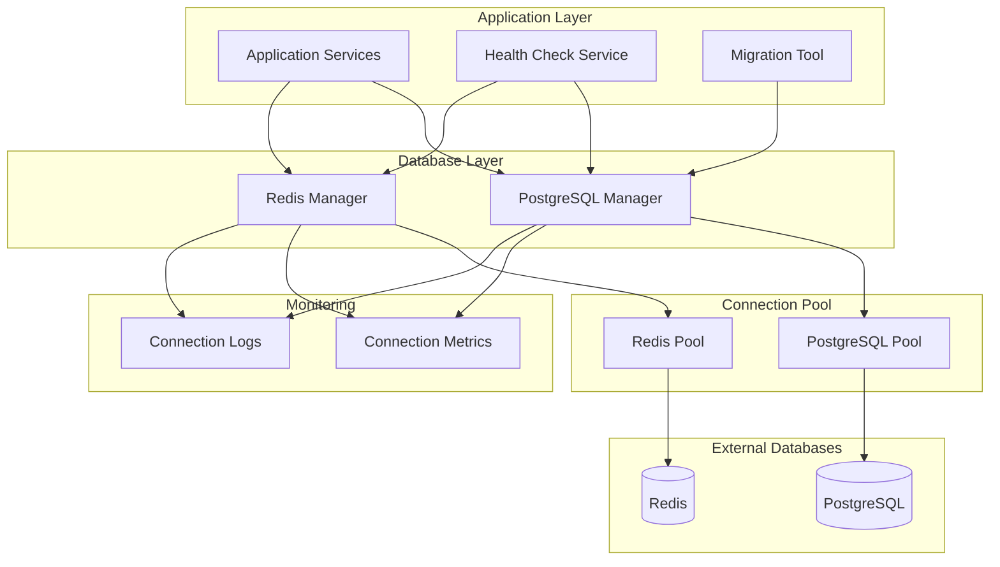
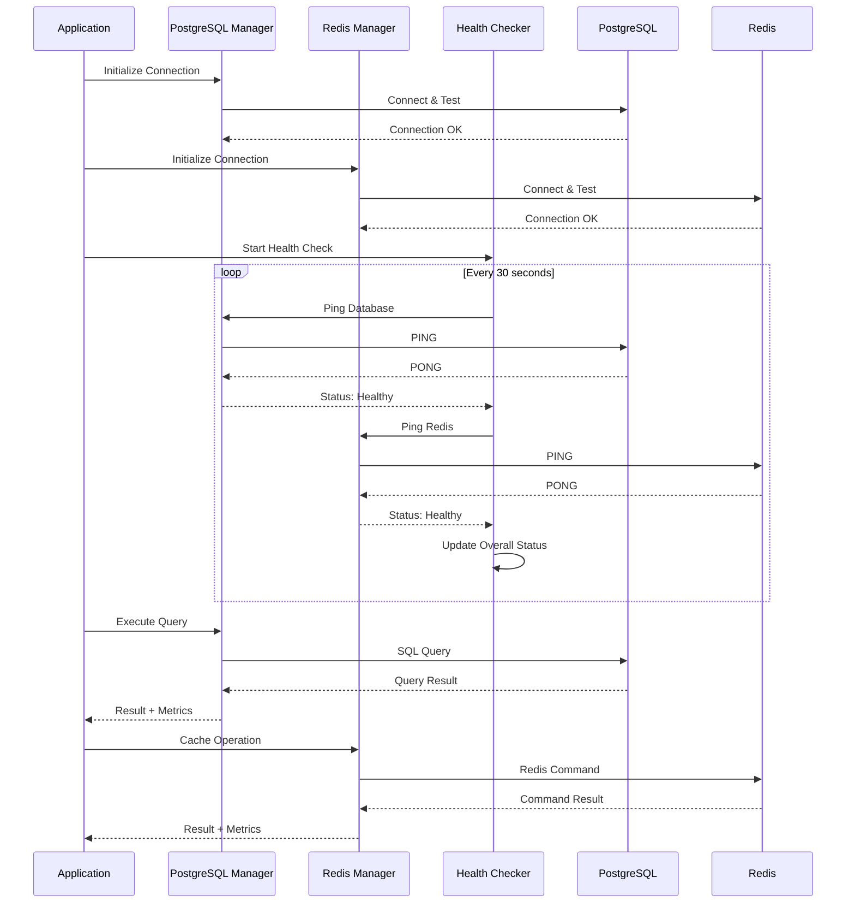

# Step 1.4: 数据库连接层实现

## 📋 实现目标

本步骤将建立完整的数据库连接和管理系统，包括 PostgreSQL 和 Redis 的连接管理、健康检查机制，以及数据库迁移工具。这为整个项目提供了可靠的数据存储基础。

## 🎯 核心功能

### 1. PostgreSQL 连接管理
- 连接池管理和配置
- 自动重连机制
- 连接健康检查
- 事务管理支持
- 查询性能监控

### 2. Redis 连接管理  
- Redis 客户端封装
- 连接池优化
- 集群支持准备
- 缓存操作封装
- 连接状态监控

### 3. 数据库健康检查
- 定期健康状态检测
- 连接可用性验证
- 性能指标收集
- 故障自动恢复

### 4. 数据库迁移工具
- 数据库版本管理
- 迁移脚本执行
- 回滚机制
- 迁移状态跟踪

## 🏗️ 架构设计



## 📁 文件结构

```
pkg/database/
├── postgres.go          # PostgreSQL 连接管理
├── redis.go             # Redis 连接管理
├── health.go            # 数据库健康检查
└── migration.go         # 迁移工具支持

cmd/migrator/
└── main.go              # 数据库迁移工具主程序

migrations/              # 数据库迁移脚本目录
├── 001_initial_schema.up.sql
├── 001_initial_schema.down.sql
└── README.md
```

## 🔧 依赖包管理

### 添加必要依赖

```bash
# PostgreSQL 驱动和 SQL 扩展
go get github.com/lib/pq
go get github.com/jmoiron/sqlx

# Redis 客户端
go get github.com/go-redis/redis/v8

# 数据库迁移工具
go get -u github.com/golang-migrate/migrate/v4
go get -u github.com/golang-migrate/migrate/v4/database/postgres
go get -u github.com/golang-migrate/migrate/v4/source/file

# Prometheus 指标
go get github.com/prometheus/client_golang/prometheus

# 日志库
go get github.com/sirupsen/logrus
```

### 更新 go.mod

在项目根目录执行：

```bash
go mod tidy
```

## 📊 数据库连接流程



## 🚀 实现步骤

### Step 1: 创建 PostgreSQL 连接管理器

创建文件 `pkg/database/postgres.go`：

```go
package database

import (
	"context"
	"database/sql"
	"fmt"
	"time"

	"github.com/jmoiron/sqlx"
	_ "github.com/lib/pq"
	"github.com/prometheus/client_golang/prometheus"
	"github.com/sirupsen/logrus"

	"simplied-blockchain-data-monitor-alert-go/internal/config"
	"simplied-blockchain-data-monitor-alert-go/pkg/logger"
)

// PostgresManager PostgreSQL 连接管理器
type PostgresManager struct {
	// 数据库连接
	db *sqlx.DB
	// 配置
	config config.DatabaseConfig
	// 日志记录器
	logger *logger.Logger
	// 指标收集器
	metrics *PostgresMetrics
}

// PostgresMetrics PostgreSQL 指标
type PostgresMetrics struct {
	// 连接池指标
	ConnectionsActive   prometheus.Gauge
	ConnectionsIdle     prometheus.Gauge
	ConnectionsWaiting  prometheus.Gauge
	// 查询指标
	QueriesTotal        *prometheus.CounterVec
	QueryDuration       *prometheus.HistogramVec
	// 错误指标
	ErrorsTotal         *prometheus.CounterVec
}

// NewPostgresManager 创建 PostgreSQL 管理器
func NewPostgresManager(cfg config.DatabaseConfig, logger *logger.Logger) (*PostgresManager, error) {
	// 构建数据库连接字符串
	dsn := fmt.Sprintf(
		"host=%s port=%d user=%s password=%s dbname=%s sslmode=%s",
		cfg.Host, cfg.Port, cfg.User, cfg.Password, cfg.Name, cfg.SSLMode,
	)

	// 创建数据库连接
	db, err := sqlx.Connect("postgres", dsn)
	if err != nil {
		return nil, fmt.Errorf("failed to connect to PostgreSQL: %w", err)
	}

	// 配置连接池
	db.SetMaxOpenConns(cfg.MaxOpenConns)
	db.SetMaxIdleConns(cfg.MaxIdleConns)
	db.SetConnMaxLifetime(cfg.ConnMaxLifetime)

	// 创建指标收集器
	metrics := &PostgresMetrics{
		ConnectionsActive: prometheus.NewGauge(prometheus.GaugeOpts{
			Name: "postgres_connections_active",
			Help: "Number of active PostgreSQL connections",
		}),
		ConnectionsIdle: prometheus.NewGauge(prometheus.GaugeOpts{
			Name: "postgres_connections_idle",
			Help: "Number of idle PostgreSQL connections",
		}),
		ConnectionsWaiting: prometheus.NewGauge(prometheus.GaugeOpts{
			Name: "postgres_connections_waiting",
			Help: "Number of waiting PostgreSQL connections",
		}),
		QueriesTotal: prometheus.NewCounterVec(
			prometheus.CounterOpts{
				Name: "postgres_queries_total",
				Help: "Total number of PostgreSQL queries",
			},
			[]string{"operation", "status"},
		),
		QueryDuration: prometheus.NewHistogramVec(
			prometheus.HistogramOpts{
				Name:    "postgres_query_duration_seconds",
				Help:    "PostgreSQL query duration in seconds",
				Buckets: []float64{0.001, 0.005, 0.01, 0.05, 0.1, 0.5, 1.0, 5.0},
			},
			[]string{"operation"},
		),
		ErrorsTotal: prometheus.NewCounterVec(
			prometheus.CounterOpts{
				Name: "postgres_errors_total",
				Help: "Total number of PostgreSQL errors",
			},
			[]string{"type"},
		),
	}

	// 注册指标
	prometheus.MustRegister(
		metrics.ConnectionsActive,
		metrics.ConnectionsIdle,
		metrics.ConnectionsWaiting,
		metrics.QueriesTotal,
		metrics.QueryDuration,
		metrics.ErrorsTotal,
	)

	manager := &PostgresManager{
		db:      db,
		config:  cfg,
		logger:  logger,
		metrics: metrics,
	}

	// 启动指标更新协程
	go manager.updateMetrics()

	logger.WithFields(logrus.Fields{
		"host": cfg.Host,
		"port": cfg.Port,
		"name": cfg.Name,
	}).Info("PostgreSQL connection established")

	return manager, nil
}

// GetDB 获取数据库连接
func (pm *PostgresManager) GetDB() *sqlx.DB {
	return pm.db
}

// Ping 检查数据库连接
func (pm *PostgresManager) Ping(ctx context.Context) error {
	start := time.Now()
	err := pm.db.PingContext(ctx)
	duration := time.Since(start)

	if err != nil {
		pm.metrics.ErrorsTotal.WithLabelValues("ping").Inc()
		pm.logger.WithFields(logrus.Fields{
			"error":    err.Error(),
			"duration": duration.Milliseconds(),
		}).Error("PostgreSQL ping failed")
		return err
	}

	pm.logger.WithFields(logrus.Fields{
		"duration": duration.Milliseconds(),
	}).Debug("PostgreSQL ping successful")

	return nil
}

// Close 关闭数据库连接
func (pm *PostgresManager) Close() error {
	if pm.db != nil {
		pm.logger.Info("Closing PostgreSQL connection")
		return pm.db.Close()
	}
	return nil
}

// ExecuteQuery 执行查询并记录指标
func (pm *PostgresManager) ExecuteQuery(ctx context.Context, operation, query string, args ...interface{}) (*sql.Rows, error) {
	start := time.Now()
	
	rows, err := pm.db.QueryContext(ctx, query, args...)
	duration := time.Since(start)
	
	// 记录指标
	pm.metrics.QueryDuration.WithLabelValues(operation).Observe(duration.Seconds())
	
	if err != nil {
		pm.metrics.QueriesTotal.WithLabelValues(operation, "error").Inc()
		pm.metrics.ErrorsTotal.WithLabelValues("query").Inc()
		
		pm.logger.WithFields(logrus.Fields{
			"operation": operation,
			"error":     err.Error(),
			"duration":  duration.Milliseconds(),
		}).Error("PostgreSQL query failed")
		
		return nil, err
	}
	
	pm.metrics.QueriesTotal.WithLabelValues(operation, "success").Inc()
	
	pm.logger.WithFields(logrus.Fields{
		"operation": operation,
		"duration":  duration.Milliseconds(),
	}).Debug("PostgreSQL query executed")
	
	return rows, nil
}

// BeginTx 开始事务
func (pm *PostgresManager) BeginTx(ctx context.Context) (*sqlx.Tx, error) {
	tx, err := pm.db.BeginTxx(ctx, nil)
	if err != nil {
		pm.metrics.ErrorsTotal.WithLabelValues("transaction").Inc()
		pm.logger.WithFields(logrus.Fields{
			"error": err.Error(),
		}).Error("Failed to begin PostgreSQL transaction")
		return nil, err
	}
	
	pm.logger.Debug("PostgreSQL transaction started")
	return tx, nil
}

// updateMetrics 更新连接池指标
func (pm *PostgresManager) updateMetrics() {
	ticker := time.NewTicker(10 * time.Second)
	defer ticker.Stop()
	
	for range ticker.C {
		stats := pm.db.Stats()
		pm.metrics.ConnectionsActive.Set(float64(stats.OpenConnections))
		pm.metrics.ConnectionsIdle.Set(float64(stats.Idle))
		pm.metrics.ConnectionsWaiting.Set(float64(stats.WaitCount))
	}
}

// GetStats 获取连接池统计信息
func (pm *PostgresManager) GetStats() sql.DBStats {
	return pm.db.Stats()
}
```

### Step 2: 创建 Redis 连接管理器

创建文件 `pkg/database/redis.go`：

```go
package database

import (
	"context"
	"fmt"
	"time"

	"github.com/go-redis/redis/v8"
	"github.com/prometheus/client_golang/prometheus"
	"github.com/sirupsen/logrus"

	"simplied-blockchain-data-monitor-alert-go/internal/config"
	"simplied-blockchain-data-monitor-alert-go/pkg/logger"
)

// RedisManager Redis 连接管理器
type RedisManager struct {
	// Redis 客户端
	client redis.UniversalClient
	// 配置
	config config.RedisConfig
	// 日志记录器
	logger *logger.Logger
	// 指标收集器
	metrics *RedisMetrics
}

// RedisMetrics Redis 指标
type RedisMetrics struct {
	// 连接指标
	ConnectionsActive   prometheus.Gauge
	ConnectionsIdle     prometheus.Gauge
	// 命令指标
	CommandsTotal       *prometheus.CounterVec
	CommandDuration     *prometheus.HistogramVec
	// 错误指标
	ErrorsTotal         *prometheus.CounterVec
	// 内存指标
	MemoryUsage         prometheus.Gauge
}

// NewRedisManager 创建 Redis 管理器
func NewRedisManager(cfg config.RedisConfig, logger *logger.Logger) (*RedisManager, error) {
	// 创建 Redis 客户端配置
	options := &redis.Options{
		Addr:     fmt.Sprintf("%s:%d", cfg.Host, cfg.Port),
		Password: cfg.Password,
		DB:       cfg.DB,
		PoolSize: cfg.PoolSize,
		
		// 连接超时配置
		DialTimeout:  5 * time.Second,
		ReadTimeout:  3 * time.Second,
		WriteTimeout: 3 * time.Second,
		
		// 连接池配置
		PoolTimeout:  4 * time.Second,
		IdleTimeout:  5 * time.Minute,
		MaxRetries:   3,
		MinIdleConns: 10,
	}

	// 创建 Redis 客户端
	client := redis.NewClient(options)

	// 测试连接
	ctx, cancel := context.WithTimeout(context.Background(), 5*time.Second)
	defer cancel()
	
	if err := client.Ping(ctx).Err(); err != nil {
		return nil, fmt.Errorf("failed to connect to Redis: %w", err)
	}

	// 创建指标收集器
	metrics := &RedisMetrics{
		ConnectionsActive: prometheus.NewGauge(prometheus.GaugeOpts{
			Name: "redis_connections_active",
			Help: "Number of active Redis connections",
		}),
		ConnectionsIdle: prometheus.NewGauge(prometheus.GaugeOpts{
			Name: "redis_connections_idle",
			Help: "Number of idle Redis connections",
		}),
		CommandsTotal: prometheus.NewCounterVec(
			prometheus.CounterOpts{
				Name: "redis_commands_total",
				Help: "Total number of Redis commands",
			},
			[]string{"command", "status"},
		),
		CommandDuration: prometheus.NewHistogramVec(
			prometheus.HistogramOpts{
				Name:    "redis_command_duration_seconds",
				Help:    "Redis command duration in seconds",
				Buckets: []float64{0.0001, 0.0005, 0.001, 0.005, 0.01, 0.05, 0.1, 0.5},
			},
			[]string{"command"},
		),
		ErrorsTotal: prometheus.NewCounterVec(
			prometheus.CounterOpts{
				Name: "redis_errors_total",
				Help: "Total number of Redis errors",
			},
			[]string{"type"},
		),
		MemoryUsage: prometheus.NewGauge(prometheus.GaugeOpts{
			Name: "redis_memory_usage_bytes",
			Help: "Redis memory usage in bytes",
		}),
	}

	// 注册指标
	prometheus.MustRegister(
		metrics.ConnectionsActive,
		metrics.ConnectionsIdle,
		metrics.CommandsTotal,
		metrics.CommandDuration,
		metrics.ErrorsTotal,
		metrics.MemoryUsage,
	)

	manager := &RedisManager{
		client:  client,
		config:  cfg,
		logger:  logger,
		metrics: metrics,
	}

	// 启动指标更新协程
	go manager.updateMetrics()

	logger.WithFields(logrus.Fields{
		"host": cfg.Host,
		"port": cfg.Port,
		"db":   cfg.DB,
	}).Info("Redis connection established")

	return manager, nil
}

// GetClient 获取 Redis 客户端
func (rm *RedisManager) GetClient() redis.UniversalClient {
	return rm.client
}

// Ping 检查 Redis 连接
func (rm *RedisManager) Ping(ctx context.Context) error {
	start := time.Now()
	err := rm.client.Ping(ctx).Err()
	duration := time.Since(start)

	if err != nil {
		rm.metrics.ErrorsTotal.WithLabelValues("ping").Inc()
		rm.logger.WithFields(logrus.Fields{
			"error":    err.Error(),
			"duration": duration.Milliseconds(),
		}).Error("Redis ping failed")
		return err
	}

	rm.logger.WithFields(logrus.Fields{
		"duration": duration.Milliseconds(),
	}).Debug("Redis ping successful")

	return nil
}

// Close 关闭 Redis 连接
func (rm *RedisManager) Close() error {
	if rm.client != nil {
		rm.logger.Info("Closing Redis connection")
		return rm.client.Close()
	}
	return nil
}

// Set 设置键值对
func (rm *RedisManager) Set(ctx context.Context, key string, value interface{}, expiration time.Duration) error {
	start := time.Now()
	
	err := rm.client.Set(ctx, key, value, expiration).Err()
	duration := time.Since(start)
	
	// 记录指标
	rm.metrics.CommandDuration.WithLabelValues("set").Observe(duration.Seconds())
	
	if err != nil {
		rm.metrics.CommandsTotal.WithLabelValues("set", "error").Inc()
		rm.metrics.ErrorsTotal.WithLabelValues("command").Inc()
		
		rm.logger.WithFields(logrus.Fields{
			"key":      key,
			"error":    err.Error(),
			"duration": duration.Milliseconds(),
		}).Error("Redis SET failed")
		
		return err
	}
	
	rm.metrics.CommandsTotal.WithLabelValues("set", "success").Inc()
	
	rm.logger.WithFields(logrus.Fields{
		"key":      key,
		"duration": duration.Milliseconds(),
	}).Debug("Redis SET executed")
	
	return nil
}

// Get 获取键值
func (rm *RedisManager) Get(ctx context.Context, key string) (string, error) {
	start := time.Now()
	
	result, err := rm.client.Get(ctx, key).Result()
	duration := time.Since(start)
	
	// 记录指标
	rm.metrics.CommandDuration.WithLabelValues("get").Observe(duration.Seconds())
	
	if err != nil {
		if err == redis.Nil {
			rm.metrics.CommandsTotal.WithLabelValues("get", "miss").Inc()
		} else {
			rm.metrics.CommandsTotal.WithLabelValues("get", "error").Inc()
			rm.metrics.ErrorsTotal.WithLabelValues("command").Inc()
		}
		
		rm.logger.WithFields(logrus.Fields{
			"key":      key,
			"error":    err.Error(),
			"duration": duration.Milliseconds(),
		}).Debug("Redis GET failed")
		
		return "", err
	}
	
	rm.metrics.CommandsTotal.WithLabelValues("get", "hit").Inc()
	
	rm.logger.WithFields(logrus.Fields{
		"key":      key,
		"duration": duration.Milliseconds(),
	}).Debug("Redis GET executed")
	
	return result, nil
}

// Delete 删除键
func (rm *RedisManager) Delete(ctx context.Context, keys ...string) error {
	start := time.Now()
	
	err := rm.client.Del(ctx, keys...).Err()
	duration := time.Since(start)
	
	// 记录指标
	rm.metrics.CommandDuration.WithLabelValues("del").Observe(duration.Seconds())
	
	if err != nil {
		rm.metrics.CommandsTotal.WithLabelValues("del", "error").Inc()
		rm.metrics.ErrorsTotal.WithLabelValues("command").Inc()
		
		rm.logger.WithFields(logrus.Fields{
			"keys":     keys,
			"error":    err.Error(),
			"duration": duration.Milliseconds(),
		}).Error("Redis DEL failed")
		
		return err
	}
	
	rm.metrics.CommandsTotal.WithLabelValues("del", "success").Inc()
	
	rm.logger.WithFields(logrus.Fields{
		"keys":     keys,
		"duration": duration.Milliseconds(),
	}).Debug("Redis DEL executed")
	
	return nil
}

// Exists 检查键是否存在
func (rm *RedisManager) Exists(ctx context.Context, keys ...string) (int64, error) {
	start := time.Now()
	
	result, err := rm.client.Exists(ctx, keys...).Result()
	duration := time.Since(start)
	
	// 记录指标
	rm.metrics.CommandDuration.WithLabelValues("exists").Observe(duration.Seconds())
	
	if err != nil {
		rm.metrics.CommandsTotal.WithLabelValues("exists", "error").Inc()
		rm.metrics.ErrorsTotal.WithLabelValues("command").Inc()
		
		rm.logger.WithFields(logrus.Fields{
			"keys":     keys,
			"error":    err.Error(),
			"duration": duration.Milliseconds(),
		}).Error("Redis EXISTS failed")
		
		return 0, err
	}
	
	rm.metrics.CommandsTotal.WithLabelValues("exists", "success").Inc()
	
	rm.logger.WithFields(logrus.Fields{
		"keys":     keys,
		"result":   result,
		"duration": duration.Milliseconds(),
	}).Debug("Redis EXISTS executed")
	
	return result, nil
}

// updateMetrics 更新 Redis 指标
func (rm *RedisManager) updateMetrics() {
	ticker := time.NewTicker(10 * time.Second)
	defer ticker.Stop()
	
	for range ticker.C {
		ctx, cancel := context.WithTimeout(context.Background(), 5*time.Second)
		
		// 获取连接池统计
		poolStats := rm.client.PoolStats()
		rm.metrics.ConnectionsActive.Set(float64(poolStats.TotalConns))
		rm.metrics.ConnectionsIdle.Set(float64(poolStats.IdleConns))
		
		// 获取内存使用情况
		if info, err := rm.client.Info(ctx, "memory").Result(); err == nil {
			// 解析内存使用信息（简化版本）
			rm.logger.WithField("memory_info", info).Debug("Redis memory info")
		}
		
		cancel()
	}
}

// GetPoolStats 获取连接池统计信息
func (rm *RedisManager) GetPoolStats() *redis.PoolStats {
    return rm.client.PoolStats()
}
```

### Step 3: 创建数据库健康检查

创建文件 `pkg/database/health.go`：

```go
package database

import (
    "context"
    "sync"
    "time"

    "github.com/sirupsen/logrus"

    "simplied-blockchain-data-monitor-alert-go/pkg/logger"
)

// HealthStatus 健康状态
type HealthStatus struct {
    Healthy bool `json:"healthy"`
    Status string `json:"status"`
    ResponseTime time.Duration `json:"response_time"`
    LastCheck time.Time `json:"last_check"`
    Error string `json:"error,omitempty"`
}

// DatabaseHealth 数据库健康状态
type DatabaseHealth struct {
    PostgreSQL HealthStatus `json:"postgresql"`
    Redis HealthStatus `json:"redis"`
    Overall HealthStatus `json:"overall"`
}

// HealthChecker 健康检查器
type HealthChecker struct {
    postgres *PostgresManager
    redis *RedisManager
    logger *logger.Logger
    health *DatabaseHealth
    mutex sync.RWMutex
    interval time.Duration
    stopChan chan struct{}
}

// NewHealthChecker 创建健康检查器
func NewHealthChecker(postgres *PostgresManager, redis *RedisManager, logger *logger.Logger) *HealthChecker {
    return &HealthChecker{
        postgres: postgres,
        redis:    redis,
        logger:   logger,
        health: &DatabaseHealth{
            PostgreSQL: HealthStatus{Status: "unknown"},
            Redis:      HealthStatus{Status: "unknown"},
            Overall:    HealthStatus{Status: "unknown"},
        },
        interval: 30 * time.Second,
        stopChan: make(chan struct{}),
    }
}

// Start 启动健康检查
func (hc *HealthChecker) Start() {
    hc.logger.Info("Starting database health checker")
    hc.checkHealth()
    
    ticker := time.NewTicker(hc.interval)
    go func() {
        defer ticker.Stop()
        for {
            select {
            case <-ticker.C:
                hc.checkHealth()
            case <-hc.stopChan:
                hc.logger.Info("Database health checker stopped")
                return
            }
        }
    }()
}

// GetHealth 获取健康状态
func (hc *HealthChecker) GetHealth() DatabaseHealth {
    hc.mutex.RLock()
    defer hc.mutex.RUnlock()
    return *hc.health
}

// checkHealth 执行健康检查
func (hc *HealthChecker) checkHealth() {
    hc.mutex.Lock()
    defer hc.mutex.Unlock()
    
    now := time.Now()
    
    pgStatus := hc.checkPostgreSQL()
    pgStatus.LastCheck = now
    hc.health.PostgreSQL = pgStatus
    
    redisStatus := hc.checkRedis()
    redisStatus.LastCheck = now
    hc.health.Redis = redisStatus
    
    overall := HealthStatus{
        Healthy:      pgStatus.Healthy && redisStatus.Healthy,
        LastCheck:    now,
        ResponseTime: (pgStatus.ResponseTime + redisStatus.ResponseTime) / 2,
    }
    
    if overall.Healthy {
        overall.Status = "healthy"
    } else {
        overall.Status = "unhealthy"
        if !pgStatus.Healthy && !redisStatus.Healthy {
            overall.Error = "Both PostgreSQL and Redis are unhealthy"
        } else if !pgStatus.Healthy {
            overall.Error = "PostgreSQL is unhealthy"
        } else {
            overall.Error = "Redis is unhealthy"
        }
    }
    
    hc.health.Overall = overall
}

// checkPostgreSQL 检查 PostgreSQL 健康状态
func (hc *HealthChecker) checkPostgreSQL() HealthStatus {
    start := time.Now()
    ctx, cancel := context.WithTimeout(context.Background(), 5*time.Second)
    defer cancel()
    
    err := hc.postgres.Ping(ctx)
    responseTime := time.Since(start)
    
    if err != nil {
        return HealthStatus{
            Healthy:      false,
            Status:       "unhealthy",
            ResponseTime: responseTime,
            Error:        err.Error(),
        }
    }
    
    return HealthStatus{
        Healthy:      true,
        Status:       "healthy",
        ResponseTime: responseTime,
    }
}

// checkRedis 检查 Redis 健康状态
func (hc *HealthChecker) checkRedis() HealthStatus {
    start := time.Now()
    ctx, cancel := context.WithTimeout(context.Background(), 5*time.Second)
    defer cancel()
    
    err := hc.redis.Ping(ctx)
    responseTime := time.Since(start)
    
    if err != nil {
        return HealthStatus{
            Healthy:      false,
            Status:       "unhealthy",
            ResponseTime: responseTime,
            Error:        err.Error(),
        }
    }
    
    return HealthStatus{
        Healthy:      true,
        Status:       "healthy",
        ResponseTime: responseTime,
    }
}
```

### Step 4: 创建数据库迁移工具

创建文件 `pkg/database/migration.go`：

```go
package database

import (
    "database/sql"
    "fmt"
    "path/filepath"

    "github.com/golang-migrate/migrate/v4"
    "github.com/golang-migrate/migrate/v4/database/postgres"
    "github.com/golang-migrate/migrate/v4/source/file"
    "github.com/sirupsen/logrus"

    "simplied-blockchain-data-monitor-alert-go/pkg/logger"
)

// Migrator 数据库迁移器
type Migrator struct {
    migrate *migrate.Migrate
    logger *logger.Logger
}

// NewMigrator 创建迁移器
func NewMigrator(db *sql.DB, migrationsPath string, logger *logger.Logger) (*Migrator, error) {
    driver, err := postgres.WithInstance(db, &postgres.Config{})
    if err != nil {
        return nil, fmt.Errorf("failed to create postgres driver: %w", err)
    }

    sourceURL := fmt.Sprintf("file://%s", filepath.Clean(migrationsPath))
    m, err := migrate.NewWithDatabaseInstance(sourceURL, "postgres", driver)
    if err != nil {
        return nil, fmt.Errorf("failed to create migrate instance: %w", err)
    }

    return &Migrator{
        migrate: m,
        logger:  logger,
    }, nil
}

// Up 执行向上迁移
func (m *Migrator) Up() error {
    m.logger.Info("Starting database migration up")
    
    err := m.migrate.Up()
    if err != nil && err != migrate.ErrNoChange {
        m.logger.WithError(err).Error("Migration up failed")
        return fmt.Errorf("migration up failed: %w", err)
    }
    
    if err == migrate.ErrNoChange {
        m.logger.Info("No migrations to apply")
    } else {
        m.logger.Info("Migration up completed successfully")
    }
    
    return nil
}

// Version 获取当前迁移版本
func (m *Migrator) Version() (uint, bool, error) {
    version, dirty, err := m.migrate.Version()
    if err != nil {
        m.logger.WithError(err).Error("Failed to get migration version")
        return 0, false, fmt.Errorf("failed to get migration version: %w", err)
    }
    
    m.logger.WithFields(logrus.Fields{
        "version": version,
        "dirty":   dirty,
    }).Info("Current migration version")
    
    return version, dirty, nil
}
```

### Step 5: 更新迁移工具主程序

更新文件 `cmd/migrator/main.go`：

```go
package main

import (
    "flag"
    "fmt"
    "os"

    "simplied-blockchain-data-monitor-alert-go/internal/config"
    "simplied-blockchain-data-monitor-alert-go/pkg/database"
    "simplied-blockchain-data-monitor-alert-go/pkg/logger"
)

func main() {
    var (
        command        = flag.String("command", "up", "Migration command: up, version")
        migrationsPath = flag.String("path", "./migrations", "Path to migrations directory")
        configPath     = flag.String("config", ".env", "Path to configuration file")
    )
    flag.Parse()

    // 加载配置
    cfg, err := config.Load(*configPath)
    if err != nil {
        fmt.Printf("Failed to load config: %v\n", err)
        os.Exit(1)
    }

    // 创建日志记录器
    loggerConfig := logger.Config{
        Level:     "info",
        Format:    "text",
        Output:    "stdout",
        Component: "migrator",
    }
    log, err := logger.New(loggerConfig)
    if err != nil {
        fmt.Printf("Failed to create logger: %v\n", err)
        os.Exit(1)
    }

    // 创建数据库连接
    pgManager, err := database.NewPostgresManager(cfg.Database, log)
    if err != nil {
        log.WithError(err).Fatal("Failed to create PostgreSQL manager")
    }
    defer pgManager.Close()

    // 创建迁移器
    migrator, err := database.NewMigrator(pgManager.GetDB().DB, *migrationsPath, log)
    if err != nil {
        log.WithError(err).Fatal("Failed to create migrator")
    }

    // 执行迁移命令
    switch *command {
    case "up":
        if err := migrator.Up(); err != nil {
            log.WithError(err).Fatal("Migration up failed")
        }
        log.Info("Migration up completed")

    case "version":
        v, dirty, err := migrator.Version()
        if err != nil {
            log.WithError(err).Fatal("Failed to get migration version")
        }
        fmt.Printf("Current version: %d, Dirty: %t\n", v, dirty)

    default:
        log.Fatal("Unknown command: " + *command)
    }
}
```

## 📁 创建迁移脚本目录

### 创建迁移脚本目录结构

```bash
mkdir -p migrations
```

### 示例迁移脚本

**文件**: `migrations/001_initial_schema.up.sql`

```sql
-- 创建用户表
CREATE TABLE IF NOT EXISTS users (
    id SERIAL PRIMARY KEY,
    telegram_id BIGINT UNIQUE NOT NULL,
    username VARCHAR(255),
    first_name VARCHAR(255),
    last_name VARCHAR(255),
    language_code VARCHAR(10) DEFAULT 'en',
    is_active BOOLEAN DEFAULT true,
    created_at TIMESTAMP WITH TIME ZONE DEFAULT NOW(),
    updated_at TIMESTAMP WITH TIME ZONE DEFAULT NOW()
);

-- 创建告警规则表
CREATE TABLE IF NOT EXISTS alert_rules (
    id SERIAL PRIMARY KEY,
    user_id INTEGER REFERENCES users(id) ON DELETE CASCADE,
    name VARCHAR(255) NOT NULL,
    description TEXT,
    rule_type VARCHAR(50) NOT NULL,
    conditions JSONB NOT NULL,
    is_active BOOLEAN DEFAULT true,
    created_at TIMESTAMP WITH TIME ZONE DEFAULT NOW(),
    updated_at TIMESTAMP WITH TIME ZONE DEFAULT NOW()
);

-- 创建告警记录表
CREATE TABLE IF NOT EXISTS alerts (
    id SERIAL PRIMARY KEY,
    rule_id INTEGER REFERENCES alert_rules(id) ON DELETE CASCADE,
    user_id INTEGER REFERENCES users(id) ON DELETE CASCADE,
    title VARCHAR(255) NOT NULL,
    message TEXT NOT NULL,
    severity VARCHAR(20) DEFAULT 'info',
    status VARCHAR(20) DEFAULT 'pending',
    metadata JSONB,
    created_at TIMESTAMP WITH TIME ZONE DEFAULT NOW(),
    sent_at TIMESTAMP WITH TIME ZONE
);

-- 创建索引
CREATE INDEX IF NOT EXISTS idx_users_telegram_id ON users(telegram_id);
CREATE INDEX IF NOT EXISTS idx_alert_rules_user_id ON alert_rules(user_id);
CREATE INDEX IF NOT EXISTS idx_alerts_rule_id ON alerts(rule_id);
```

**文件**: `migrations/001_initial_schema.down.sql`

```sql
-- 删除索引
DROP INDEX IF EXISTS idx_alerts_rule_id;
DROP INDEX IF EXISTS idx_alert_rules_user_id;
DROP INDEX IF EXISTS idx_users_telegram_id;

-- 删除表
DROP TABLE IF EXISTS alerts;
DROP TABLE IF EXISTS alert_rules;
DROP TABLE IF EXISTS users;
```

## 🧪 测试和验证

### 1. 测试数据库连接

创建测试文件 `test_database.go`：

```go
package main

import (
    "context"
    "fmt"
    "time"

    "simplied-blockchain-data-monitor-alert-go/internal/config"
    "simplied-blockchain-data-monitor-alert-go/pkg/database"
    "simplied-blockchain-data-monitor-alert-go/pkg/logger"
)

func main() {
    // 加载配置
    cfg, err := config.Load(".env")
    if err != nil {
        panic(err)
    }

    // 创建日志记录器
    loggerConfig := logger.Config{
        Level:     "info",
        Format:    "text",
        Output:    "stdout",
        Component: "test",
    }
    log, err := logger.New(loggerConfig)
    if err != nil {
        panic(err)
    }

    // 测试 PostgreSQL 连接
    fmt.Println("Testing PostgreSQL connection...")
    pgManager, err := database.NewPostgresManager(cfg.Database, log)
    if err != nil {
        panic(err)
    }
    defer pgManager.Close()

    ctx, cancel := context.WithTimeout(context.Background(), 5*time.Second)
    defer cancel()
    
    if err := pgManager.Ping(ctx); err != nil {
        panic(err)
    }
    fmt.Println("✅ PostgreSQL connection successful")

    // 测试 Redis 连接
    fmt.Println("Testing Redis connection...")
    redisManager, err := database.NewRedisManager(cfg.Redis, log)
    if err != nil {
        panic(err)
    }
    defer redisManager.Close()

    if err := redisManager.Ping(ctx); err != nil {
        panic(err)
    }
    fmt.Println("✅ Redis connection successful")

    // 测试健康检查
    fmt.Println("Testing health checker...")
    healthChecker := database.NewHealthChecker(pgManager, redisManager, log)
    healthChecker.Start()
    
    time.Sleep(2 * time.Second)
    health := healthChecker.GetHealth()
    
    fmt.Printf("PostgreSQL: %s (Response: %dms)\n", 
        health.PostgreSQL.Status, 
        health.PostgreSQL.ResponseTime.Milliseconds())
    fmt.Printf("Redis: %s (Response: %dms)\n", 
        health.Redis.Status, 
        health.Redis.ResponseTime.Milliseconds())
    fmt.Printf("Overall: %s\n", health.Overall.Status)
    
    if health.Overall.Healthy {
        fmt.Println("✅ All database connections are healthy")
    } else {
        fmt.Println("❌ Some database connections are unhealthy")
    }
}
```

### 2. 运行测试

```bash
# 编译并运行测试
go run test_database.go

# 运行数据库迁移
go run cmd/migrator/main.go -command=up

# 检查迁移版本
go run cmd/migrator/main.go -command=version
```

## 📋 完成检查清单

- ✅ PostgreSQL 连接管理器实现
- ✅ Redis 连接管理器实现
- ✅ 数据库健康检查实现
- ✅ 数据库迁移工具实现
- ✅ 迁移脚本示例创建
- ✅ 连接池配置和监控
- ✅ Prometheus 指标集成
- ✅ 错误处理和日志记录
- ✅ 测试和验证步骤

## 🎯 下一步计划

完成 Step 1.4 后，可以继续进行：

1. **Step 2.1**: 数据模型设计 - 定义核心业务数据结构
2. **Step 2.2**: 以太坊客户端集成 - 建立与区块链网络的连接
3. **单元测试**: 为数据库连接层编写完整的单元测试
4. **集成测试**: 测试数据库连接在真实环境中的表现

## 💡 最佳实践总结

### 连接管理
- 使用连接池优化性能
- 实现自动重连机制
- 配置合理的超时时间
- 监控连接池状态

### 健康检查
- 定期检查数据库连接状态
- 提供详细的健康状态信息
- 支持优雅的故障恢复
- 集成到监控系统

### 数据库迁移
- 使用版本化的迁移脚本
- 支持向上和向下迁移
- 提供迁移状态查询
- 确保迁移的原子性

### 监控和日志
- 收集详细的性能指标
- 记录所有数据库操作
- 提供 Prometheus 兼容指标
- 支持结构化日志记录

---

🎉 **Step 1.4 数据库连接层实现完成！**

这个实现为整个项目提供了可靠的数据存储基础，包括高性能的连接管理、全面的健康监控、灵活的迁移工具，以及完整的可观测性支持。
